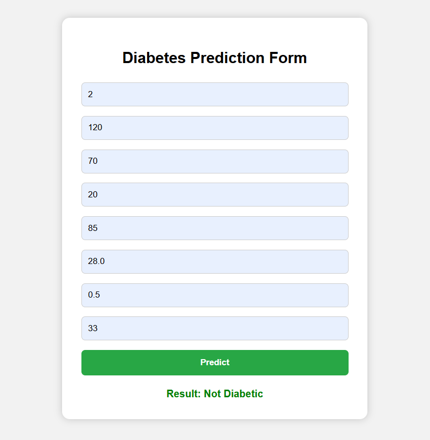

# 🧠 Diabetes Prediction Project (CodTech Internship - Task 3)

## ✅ Objective
Develop an **end-to-end data science project** for **Diabetes Prediction**, covering everything from data preprocessing to deployment using **Flask**.

---

## 📊 Dataset
We used the Pima Indians Diabetes Dataset (from Kaggle/UCI Repository), containing the following features:
- Pregnancies
- Glucose
- Blood Pressure
- Skin Thickness
- Insulin
- BMI
- Diabetes Pedigree Function
- Age

Target variable: `Outcome` (1 = Diabetic, 0 = Not Diabetic)

---

## 🧠 Model
The model is trained using **Logistic Regression** from `scikit-learn`. It was serialized using `pickle` for deployment.

---

## 📁 Project Structure

Diabetes_Prediction_Project/
│
├── app.py # Flask app
├── model.pkl # Trained model
├── requirements.txt # Dependencies
├── templates/
│ └── index.html # Web form for prediction
├── static/
│ └── prediction_output.png # Sample output screenshot
└── README.md # Project documentation


---

## 🚀 Deployment

Live URL:  
👉 [https://diabetes-prediction-project-8cpq.onrender.com](https://diabetes-prediction-project-8cpq.onrender.com)

Deployed on [Render](https://render.com) using:
- `Build Command`: `pip install -r requirements.txt`
- `Start Command`: `gunicorn app:app`

---

## ▶️ How to Run Locally

1. Clone the repo:
```bash
git clone https://github.com/yourusername/Diabetes-Prediction-Project.git
cd Diabetes-Prediction-Project
```

---

2. Install dependencies:

```bash
pip install -r requirements.txt
```

---

3. Run the app:

```bash
python app.py
```

---

4. Open your browser and go to:

http://127.0.0.1:5000

---

## 📷 Sample Output

Below is a sample prediction result from the deployed web app:


